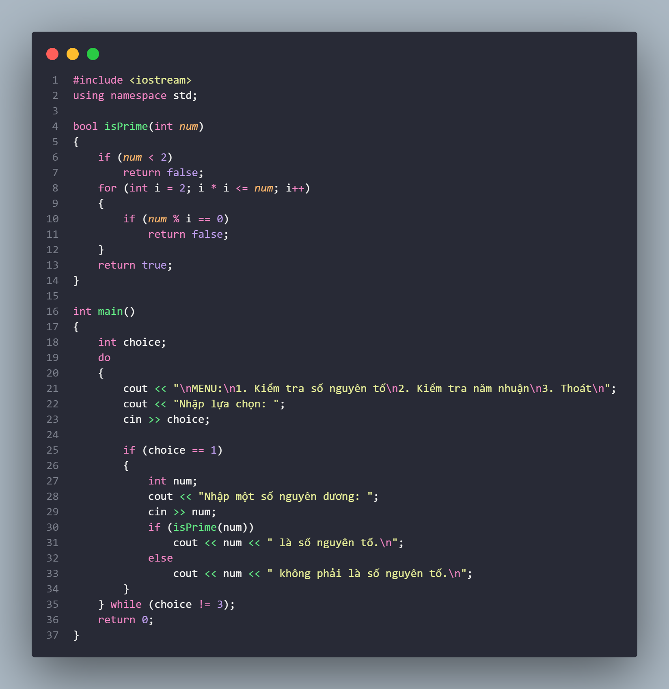
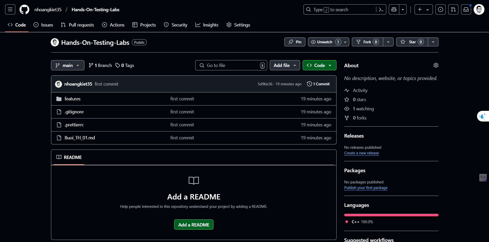
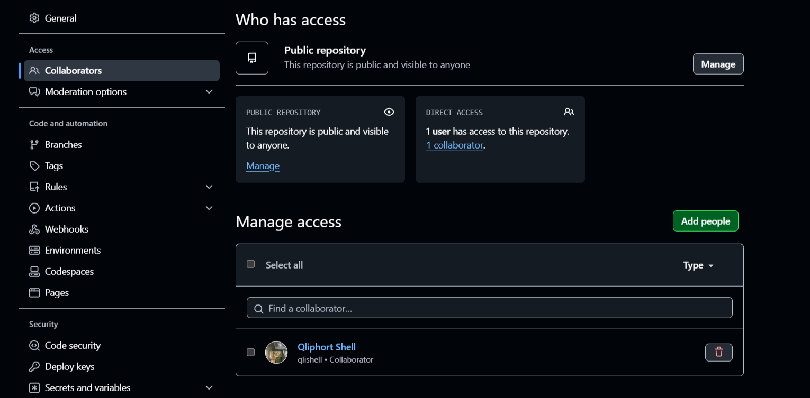
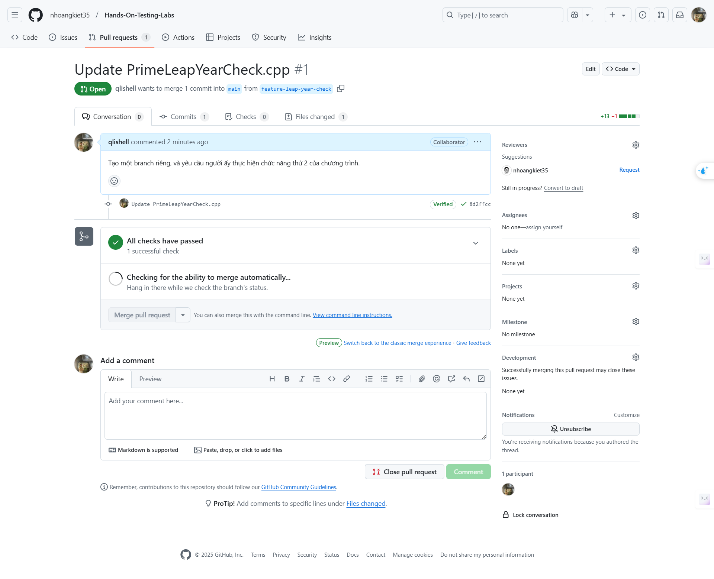

# Bài Tập Git/GitHub

## Đề bài

1. Tạo một Project C++ bằng Visual Studio:

   Viết một chương trình tạo một menu có 2 chức năng:

   1. Chức năng 1: cho người dùng nhập một số nguyên dương và kiểm tra xem số đó có phải là số nguyên tố hay không ?
   2. Chức năng 2: cho người dùng nhập vào một năm và kiểm tra xem có phải là năm nhuận hay không ?

   Bạn hãy viết chức năng 1 cho chương trình

   Sau đó đẩy Project này lên tài khoản GitHub của bạn

2. Invite một người khác tham gia vào project của bạn

   Tạo một branch riêng, và yêu cầu người ấy thực hiện chức năng thứ 2 của chương trình.

   Sau đó push cập nhật len branch mới

3. Merge branch mới vào main

## Bài làm

### 1. Tạo Project C++ bằng Visual Studio Code

- Mình đã tạo một project C++ trong Visual Studio và đặt tên project là `PrimeLeapYearCheck`.
- Dưới đây là code cho chức năng 1: Kiểm tra số nguyên tố nguyên dương
  

### 2. Đẩy project lên GitHub

- Đã khởi tạo Git repo bên trong Visual Studio Code.
- Sử dụng các lệnh Git:

  ```bash
  git init
  git add .
  git commit -m "first commit"
  git remote add origin https://github.com/nhoangkiet35/Hands-On-Testing-Labs
  git push -u origin main
  ```

- Đồng thời, đã kiểm tra GitHub repository đã nhận code hay chưa.
  

### 3. Mời người khác tham gia vào project

- Truy cập repository trên GitHub, vào Settings > Collaborators.
- Invite người dùng khác tham gia và chờ họ accept lời mời.
  

### 4. Tạo branch và yêu cầu cộng tác viên thêm chức năng 2

- Tạo một branch mới:

  ```bash
  git checkout -b feature-leap-year-check
  ```

- Yêu cầu người tham gia viết hàm kiểm tra năm nhuận và commit code vào branch này.
  

### 5. Merge branch mới vào main

- Sau khi cộng tác viên push cập nhật lên branch feature-leap-year-check, tiến hành merge:

  ```bash
  git checkout main
  git merge feature-leap-year-check
  git push origin main
  ```

- Kiểm tra trên GitHub repository đảm bảo mã nguồn đã được merge thành công.
  

## Kết quả

Dự án đã hoàn thành với 2 chức năng chính:

1. Kiểm tra số nguyên tố.
2. Kiểm tra năm nhuận (do cộng tác viên thực hiện).

Code đã được đẩy lên GitHub và merge thành công vào branch `main`.


